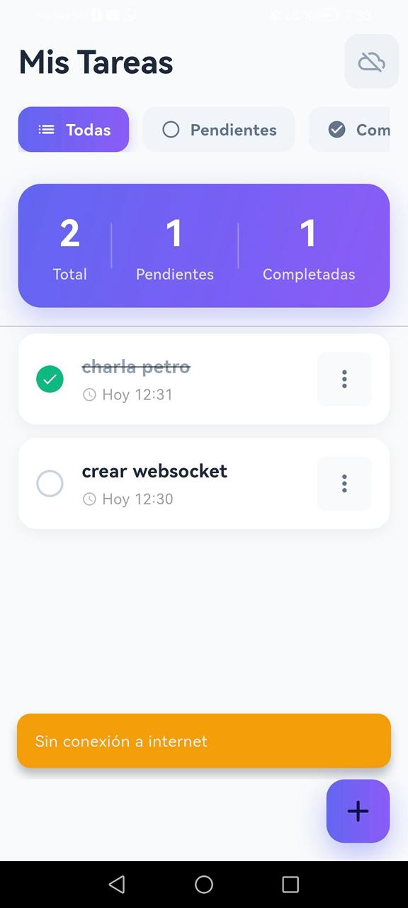
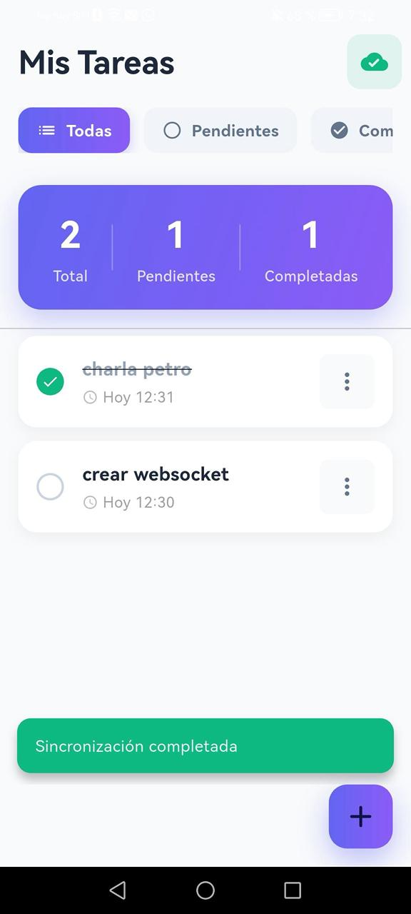
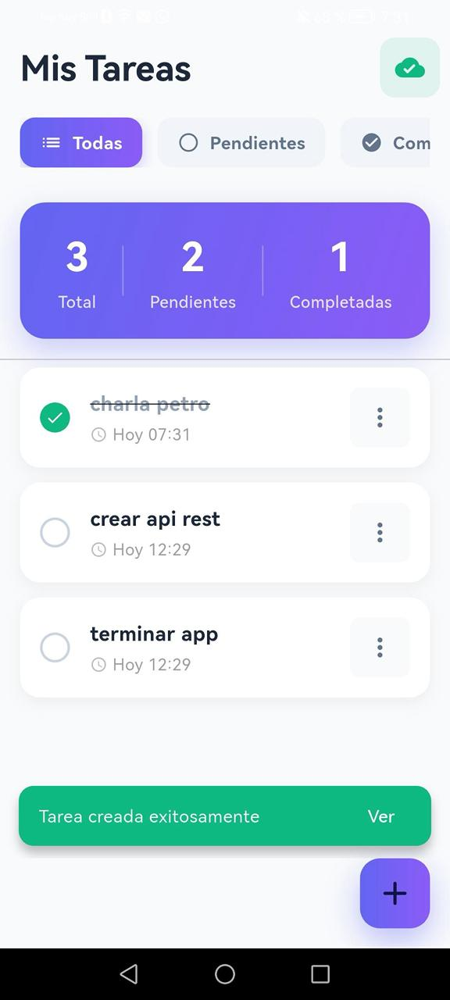
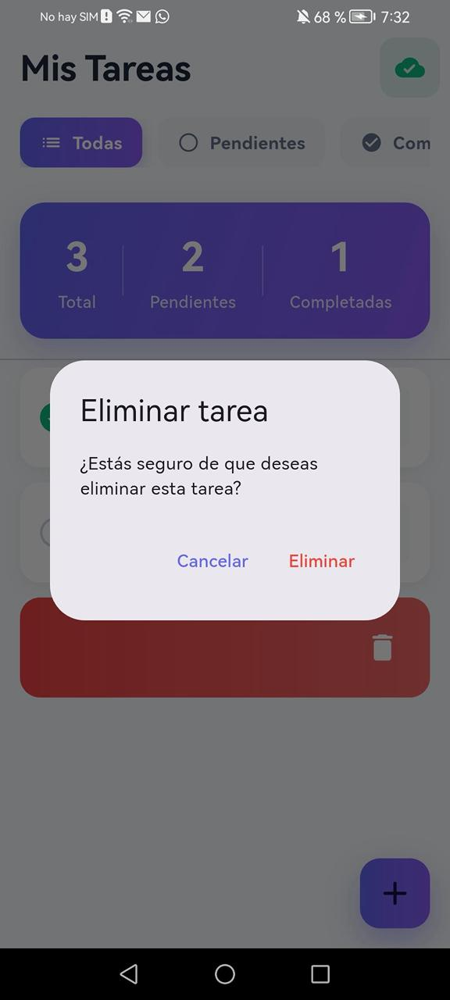
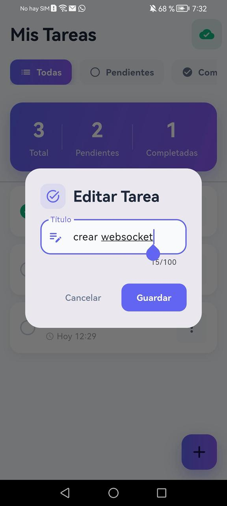

# To-Do List - Flutter App con Arquitectura Limpia

Aplicación móvil Flutter para gestión de tareas que implementa **Clean Architecture** (Arquitectura Limpia), con persistencia local usando SQLite y sincronización con API REST. La app funciona completamente offline y sincroniza automáticamente cuando hay conexión.

---

## 📑 Tabla de Contenidos

- [Arquitectura y Tecnologías](#-arquitectura-y-tecnologías)
- [Estructura de Carpetas](#-estructura-de-carpetas-y-explicación-de-capas)
- [Características](#-características-implementadas)
- [Requisitos Previos](#-requisitos-previos)
- [Instalación y Ejecución](#-instalación-y-ejecución)
- [Probar Modo Offline y Sincronización](#-cómo-probar-el-modo-offline-y-sincronización)
- [Integración con Backend](#-integración-con-backend)
- [Base de Datos Local](#-base-de-datos-local)
- [Solución de Problemas](#-solución-de-problemas)

---

## 🏗️ Arquitectura y Tecnologías

### Arquitectura: Clean Architecture

El proyecto implementa los principios de **Clean Architecture** propuestos por Robert C. Martin (Uncle Bob), organizando el código en capas independientes con responsabilidades bien definidas:

```
┌─────────────────────────────────────────────┐
│         PRESENTATION LAYER                  │
│  (UI, Widgets, Providers, State Management) │
└─────────────────┬───────────────────────────┘
                  │
┌─────────────────▼───────────────────────────┐
│           DOMAIN LAYER                      │
│    (Entities, Repository Interfaces,        │
│         Business Logic)                     │
└─────────────────┬───────────────────────────┘
                  │
┌─────────────────▼───────────────────────────┐
│            DATA LAYER                       │
│  (Repositories, Models, Data Sources,       │
│      SQLite, HTTP Client)                   │
└─────────────────────────────────────────────┘
```

### Tecnologías Utilizadas

| Tecnología | Versión | Propósito |
|------------|---------|-----------|
| **Flutter** | 3.10+ | Framework de desarrollo móvil |
| **Dart** | 3.10+ | Lenguaje de programación |
| **Provider** | ^6.1.1 | Gestión de estado reactiva |
| **SQLite (sqflite)** | ^2.3.2 | Base de datos local para modo offline |
| **HTTP** | ^1.2.0 | Cliente HTTP para comunicación con API REST |
| **connectivity_plus** | ^5.0.2 | Detección de estado de conectividad |
| **UUID** | ^4.3.3 | Generación de identificadores únicos |
| **intl** | ^0.19.0 | Internacionalización y formateo de fechas |

### Patrones de Diseño Implementados

- **Repository Pattern**: Abstracción de fuentes de datos
- **Provider Pattern**: Gestión de estado reactivo
- **Singleton Pattern**: Instancia única de base de datos
- **Factory Pattern**: Construcción de modelos desde diferentes fuentes
- **Observer Pattern**: Notificación de cambios de estado

---

## 📂 Estructura de Carpetas y Explicación de Capas

```
lib/
├── 📁 core/                           # Funcionalidades compartidas
│   ├── constants/
│   │   └── api_constants.dart        # URLs y configuración de API
│   ├── errors/
│   │   └── failures.dart             # Clases de error personalizadas
│   └── utils/
│       └── date_utils.dart           # Utilidades para fechas ISO8601
│
├── 📁 domain/                         # CAPA DE DOMINIO (Lógica de Negocio)
│   ├── entities/
│   │   └── task.dart                 # Entidad Task (objeto de negocio puro)
│   └── repositories/
│       └── task_repository.dart      # Contrato/Interfaz del repositorio
│
├── 📁 data/                           # CAPA DE DATOS (Implementación)
│   ├── datasources/
│   │   ├── local_data_source.dart    # Operaciones SQLite
│   │   └── remote_data_source.dart   # Llamadas HTTP a API REST
│   ├── models/
│   │   ├── task_model.dart           # Modelo con conversión JSON/SQLite
│   │   └── queue_operation_model.dart # Modelo de cola de sincronización
│   └── repositories/
│       └── task_repository_impl.dart  # Implementación del repositorio
│
└── 📁 presentation/                   # CAPA DE PRESENTACIÓN (UI)
    ├── providers/
    │   └── task_provider.dart        # Provider (Estado + Lógica de UI)
    ├── screens/
    │   └── task_list_screen.dart     # Pantalla principal de tareas
    └── widgets/
        ├── task_item.dart            # Widget de item de tarea
        ├── task_form_dialog.dart     # Diálogo crear/editar tarea
        └── filter_chip_row.dart      # Chips de filtro (Todas/Pendientes/Completadas)
```

### 🔵 Capa de Dominio (Domain Layer)

**Propósito**: Contiene la lógica de negocio pura, independiente de frameworks y detalles de implementación.

- **`entities/task.dart`**: Define la entidad `Task` que representa una tarea en términos de negocio.
  - Sin dependencias externas
  - Inmutable (usa `copyWith` para modificaciones)
  - Representa el core del negocio

- **`repositories/task_repository.dart`**: Define el contrato (interfaz) que debe cumplir cualquier implementación de repositorio.
  - Operaciones CRUD abstractas
  - Sin implementación concreta
  - Permite inyección de dependencias

### 🟢 Capa de Datos (Data Layer)

**Propósito**: Implementa la obtención y persistencia de datos desde diferentes fuentes.

- **`datasources/local_data_source.dart`**: 
  - Maneja operaciones SQLite
  - CRUD de tareas locales
  - Gestión de cola de sincronización
  - Operaciones de soft delete y hard delete

- **`datasources/remote_data_source.dart`**:
  - Cliente HTTP para API REST
  - Manejo de timeouts y errores
  - Conversión de respuestas HTTP a modelos
  - Implementación de Idempotency-Key

- **`models/task_model.dart`**:
  - Extiende la entidad `Task`
  - Conversión desde/hacia JSON (API)
  - Conversión desde/hacia Map (SQLite)
  - Bridge entre dominio y fuentes de datos

- **`models/queue_operation_model.dart`**:
  - Representa operaciones pendientes de sincronizar
  - Almacena tipo de operación (CREATE/UPDATE/DELETE)
  - Contador de reintentos y errores

- **`repositories/task_repository_impl.dart`**:
  - Implementa la interfaz `TaskRepository`
  - Orquesta `LocalDataSource` y `RemoteDataSource`
  - Estrategia Offline-First
  - Resolución de conflictos (Last-Write-Wins)
  - Cola de sincronización automática

### 🟡 Capa de Presentación (Presentation Layer)

**Propósito**: Maneja la interfaz de usuario y la interacción con el usuario.

- **`providers/task_provider.dart`**:
  - Gestión de estado con `ChangeNotifier`
  - Estados: `initial`, `loading`, `loaded`, `error`
  - Métodos para CRUD de tareas
  - Notifica cambios a los widgets

- **`screens/task_list_screen.dart`**:
  - Pantalla principal de la app
  - AppBar con indicador de conexión
  - Filtros de tareas
  - Lista de tareas con pull-to-refresh
  - FAB para crear tareas

- **`widgets/`**:
  - Componentes reutilizables de UI
  - Cada widget tiene una responsabilidad única
  - Diseño moderno con Material 3

---

## 🚀 Características Implementadas

### ✅ Funcionalidades Principales
- ✨ **CRUD completo** de tareas (Crear, Leer, Actualizar, Eliminar)
- 🔍 **Filtros** por estado (todas, pendientes, completadas)
- 📊 **Estadísticas** en tiempo real (total, pendientes, completadas)
- 👆 **Swipe gestures** para marcar completadas o eliminar
- 🔄 **Pull to refresh** para actualizar datos
- 🌐 **Indicador de conectividad** en tiempo real
- 🎨 **Diseño moderno** con Material 3 y gradientes

### ✅ Persistencia y Sincronización
- 📴 **Offline-First**: Los datos se cargan primero desde SQLite
- 🔄 **Sincronización en segundo plano** cuando hay conexión
- 📋 **Cola de operaciones** para sincronizar cambios pendientes
- ⚔️ **Resolución de conflictos** con estrategia Last-Write-Wins (LWW)
- 🔁 **Reintentos automáticos** con backoff exponencial
- 🔑 **Idempotency-Key** para evitar duplicaciones
- 🧹 **Limpieza automática** de operaciones antiguas (>7 días)

### ✅ Gestión de Estado
- 🎯 **Provider** para gestión de estado reactiva
- 📡 Estados: `initial`, `loading`, `loaded`, `error`
- ⚠️ Manejo robusto de errores con mensajes claros
- 🔔 Notificaciones (SnackBars) con diseño moderno

---

## 📋 Requisitos Previos

Antes de comenzar, asegúrate de tener instalado:

- ✅ **Flutter SDK 3.10+** - [Descargar](https://flutter.dev/docs/get-started/install)
- ✅ **Dart SDK 3.10+** (incluido con Flutter)
- ✅ **Android Studio** / **VS Code** con extensiones de Flutter
- ✅ **Git** para clonar el repositorio
- ✅ Un **emulador** o **dispositivo físico**
- ✅ **Backend FastAPI** corriendo (ver documentación del backend)

Verifica tu instalación:
```bash
flutter doctor
```

---

## 🔧 Instalación y Ejecución

### Paso 1: Clonar el Repositorio

```bash
git clone https://github.com/SantyMsss/to-do-list.git
cd to-do-list
```

### Paso 2: Instalar Dependencias

```bash
flutter pub get
```

### Paso 3: Configurar la URL del Backend

Edita el archivo `lib/core/constants/api_constants.dart`:

```dart
class ApiConstants {
  // Configuración según tu entorno:
  
  // Para Android Emulator (emulador de Android)
  static const String baseUrl = 'http://10.0.2.2:8000';
  
  // Para iOS Simulator (simulador de iOS en Mac)
  // static const String baseUrl = 'http://localhost:8000';
  
  // Para Dispositivo Físico (conectado a la misma red)
  // static const String baseUrl = 'http://TU_IP_LOCAL:8000';
  // Ejemplo: 'http://192.168.1.100:8000'
  
  static const String tasksEndpoint = '/tasks';
  
  // Headers
  static const String contentType = 'application/json';
  static const String idempotencyKeyHeader = 'Idempotency-Key';
  
  // Timeouts
  static const Duration connectionTimeout = Duration(seconds: 10);
  static const Duration receiveTimeout = Duration(seconds: 10);
}
```

**Notas importantes:**
- `10.0.2.2` es la IP especial en Android Emulator que apunta al localhost de tu PC
- Para dispositivos físicos, encuentra tu IP local con:
  - **Windows**: `ipconfig` (busca IPv4)
  - **Mac/Linux**: `ifconfig` o `ip addr`

### Paso 4: Iniciar el Backend (FastAPI)

Antes de ejecutar la app, asegúrate de que el backend esté corriendo:

```bash
# En la carpeta del backend
cd ../todo-service
python main.py
```

Verifica que esté disponible en: `http://localhost:8000/docs`

### Paso 5: Ejecutar la Aplicación

#### Opción A: Desde la línea de comandos

```bash
# Ver dispositivos disponibles
flutter devices

# Ejecutar en un dispositivo específico
flutter run -d <device-id>

# Ejecutar en Android
flutter run -d android

# Ejecutar en iOS (solo Mac)
flutter run -d ios

# Ejecutar en Windows
flutter run -d windows

# Ejecutar en Chrome (web)
flutter run -d chrome
```

#### Opción B: Desde VS Code o Android Studio

1. Abre el proyecto en tu IDE
2. Selecciona un dispositivo/emulador
3. Presiona F5 o el botón "Run"

### Paso 6: Verificar que Funciona

1. La app debe iniciar sin errores
2. Verifica el ícono de nube en verde (conectado)
3. Crea una tarea de prueba
4. Verifica que aparezca en el backend: `http://localhost:8000/docs` → GET /tasks

---

## 🧪 Cómo Probar el Modo Offline y Sincronización

### 🔴 Prueba 1: Modo Offline Completo

**Objetivo**: Verificar que la app funciona completamente sin conexión a internet.

1. **Preparación**:
   - Abre la app con conexión activa
   - Crea 2-3 tareas iniciales
   - Verifica que se sincronizan (ícono de nube verde)

2. **Activar Modo Offline**:
   - **Opción A**: Activa el modo avión en tu dispositivo
   - **Opción B**: Detén el backend FastAPI
   - Observa que el ícono de nube cambia a gris

3. **Operaciones Offline**:
   ```
   ✅ Crear nueva tarea: "Comprar pan"
   ✅ Editar tarea existente: cambiar título
   ✅ Marcar tarea como completada: tap en la tarea
   ✅ Eliminar una tarea: swipe izquierda
   ✅ Filtrar tareas: usar chips de filtro
   ```

4. **Verificar Persistencia Local**:
   - Cierra completamente la app (force close)
   - Vuelve a abrir la app (sigue sin conexión)
   - **Resultado esperado**: Todas las tareas y cambios siguen ahí

5. **Verificar Cola de Sincronización**:
   - Las operaciones se guardaron en la tabla `queue_operations`
   - Esperando para sincronizar cuando haya conexión

### 🟢 Prueba 2: Sincronización Automática al Reconectar

**Objetivo**: Verificar que los cambios offline se sincronizan automáticamente.

1. **Con cambios pendientes offline**:
   - Asegúrate de tener al menos 3 operaciones pendientes
   - El ícono de nube debe estar gris (sin conexión)

2. **Reconectar**:
   - Desactiva el modo avión
   - O inicia el backend FastAPI
   - **Observa**:
     - El ícono de nube cambia a verde
     - (Opcional) Presiona el ícono de nube para forzar sincronización

3. **Verificar Sincronización**:
   - Abre el backend: `http://localhost:8000/docs`
   - Ejecuta GET /tasks
   - **Resultado esperado**: Todas las tareas creadas offline están en el servidor

4. **Verificar que la cola se vació**:
   - Las operaciones exitosas se eliminaron de `queue_operations`
   - La app ya no muestra cambios pendientes

### 🔄 Prueba 3: Sincronización Bidireccional

**Objetivo**: Verificar que los cambios del servidor se reflejan en la app.

1. **Crear tarea desde el servidor**:
   ```bash
   curl -X POST "http://localhost:8000/tasks" \
     -H "Content-Type: application/json" \
     -d '{"title":"Tarea desde API","completed":false}'
   ```

2. **Sincronizar en la app**:
   - En la app, desliza hacia abajo (pull-to-refresh)
   - O presiona el ícono de nube
   - **Resultado esperado**: La nueva tarea aparece en la lista

3. **Editar tarea desde el servidor**:
   ```bash
   curl -X PUT "http://localhost:8000/tasks/1" \
     -H "Content-Type: application/json" \
     -d '{"completed":true}'
   ```

4. **Refrescar en la app**:
   - Pull-to-refresh nuevamente
   - **Resultado esperado**: La tarea #1 aparece como completada

### ⚔️ Prueba 4: Resolución de Conflictos (Last-Write-Wins)

**Objetivo**: Verificar que prevalece la versión más reciente.

1. **Escenario de conflicto**:
   - Crea una tarea en la app: "Tarea Conflicto"
   - Activa modo offline
   - Edita la tarea en la app: "Tarea Conflicto - App"
   - Edita la misma tarea en el servidor: "Tarea Conflicto - Server"

2. **Reconectar y sincronizar**:
   - Desactiva modo offline
   - Presiona el ícono de nube

3. **Verificar resolución**:
   - **Resultado esperado**: Prevalece la versión con `updated_at` más reciente
   - Normalmente la del servidor (fue editada después)

### 🔁 Prueba 5: Reintentos Automáticos

**Objetivo**: Verificar que las operaciones fallidas se reintentan.

1. **Crear operaciones que fallarán**:
   - Asegúrate de que el backend esté detenido
   - Crea 3 tareas en la app

2. **Intentar sincronizar sin servidor**:
   - Desactiva modo avión (hay "internet" pero no servidor)
   - Presiona el ícono de nube
   - **Observa**: Operaciones fallan y se quedan en la cola

3. **Iniciar el servidor**:
   - Inicia el backend: `python main.py`
   - Presiona el ícono de nube nuevamente
   - **Resultado esperado**: Las 3 tareas se sincronizan exitosamente

4. **Verificar límite de reintentos**:
   - Las operaciones que fallan más de 5 veces se eliminan automáticamente
   - Esto previene que la cola crezca indefinidamente

### 📊 Prueba 6: Estadísticas en Tiempo Real

**Objetivo**: Verificar que las estadísticas se actualizan correctamente.

1. **Crear tareas**:
   - Crea 5 tareas nuevas
   - **Observa**: El contador "Total" y "Pendientes" aumenta

2. **Completar tareas**:
   - Marca 3 tareas como completadas (tap en la tarea)
   - **Observa**: 
     - "Pendientes" disminuye a 2
     - "Completadas" aumenta a 3

3. **Eliminar tareas**:
   - Elimina 1 tarea (swipe izquierda)
   - **Observa**: "Total" disminuye a 4

4. **Verificar en offline**:
   - Activa modo avión
   - Las estadísticas siguen funcionando con datos locales

---

## 🔌 Integración con Backend

La app está diseñada para funcionar con el backend FastAPI proporcionado.

### Endpoints Consumidos

| Método | Endpoint | Uso | Headers Especiales |
|--------|----------|-----|-------------------|
| GET | `/tasks` | Obtener todas las tareas | - |
| GET | `/tasks?completed=true` | Filtrar completadas | - |
| GET | `/tasks?completed=false` | Filtrar pendientes | - |
| GET | `/tasks/{id}` | Obtener una tarea específica | - |
| POST | `/tasks` | Crear nueva tarea | `Idempotency-Key` |
| PUT | `/tasks/{id}` | Actualizar tarea | - |
| DELETE | `/tasks/{id}` | Eliminar tarea | - |

### Headers Enviados

```http
Content-Type: application/json
Idempotency-Key: <uuid-v4>  # Solo en POST /tasks
```

### Formato de Datos

**Request (POST /tasks)**:
```json
{
  "title": "Completar proyecto Flutter",
  "completed": false
}
```

**Response (GET /tasks)**:
```json
[
  {
    "id": 1,
    "title": "Completar proyecto Flutter",
    "completed": false,
    "created_at": "2024-01-15T10:30:00Z",
    "updated_at": "2024-01-15T10:30:00Z"
  }
]
```

### Timeouts Configurados

- **Connection Timeout**: 10 segundos
- **Receive Timeout**: 10 segundos

Si una petición tarda más, se considera fallida y se reintenta.

---

## 🗃️ Base de Datos Local

La app usa SQLite para persistencia local. Se crean 2 tablas:

### Tabla `tasks`

Almacena las tareas localmente.

```sql
CREATE TABLE tasks (
  id TEXT PRIMARY KEY,           -- UUID generado localmente
  title TEXT NOT NULL,           -- Título de la tarea
  completed INTEGER NOT NULL DEFAULT 0,  -- 0 = pendiente, 1 = completada
  created_at TEXT NOT NULL,      -- Fecha ISO8601
  updated_at TEXT NOT NULL,      -- Fecha ISO8601
  deleted INTEGER NOT NULL DEFAULT 0     -- 0 = activa, 1 = eliminada (soft delete)
);

-- Índices para optimización
CREATE INDEX idx_tasks_completed ON tasks (completed);
CREATE INDEX idx_tasks_deleted ON tasks (deleted);
```

### Tabla `queue_operations`

Cola de operaciones pendientes de sincronizar.

```sql
CREATE TABLE queue_operations (
  id TEXT PRIMARY KEY,           -- UUID único de la operación
  entity TEXT NOT NULL,          -- Tipo de entidad ('task')
  entity_id TEXT NOT NULL,       -- ID de la tarea afectada
  op TEXT NOT NULL,              -- Operación: CREATE | UPDATE | DELETE
  payload TEXT,                  -- Datos de la operación (JSON serializado)
  created_at INTEGER NOT NULL,   -- Timestamp Unix
  attempt_count INTEGER NOT NULL DEFAULT 0,  -- Número de reintentos
  last_error TEXT                -- Último mensaje de error
);

-- Índice para búsquedas rápidas
CREATE INDEX idx_queue_entity ON queue_operations (entity, entity_id);
```

### Ubicación de la Base de Datos

- **Android**: `/data/data/com.example.app/databases/todo_app.db`
- **iOS**: `~/Library/Application Support/todo_app.db`
- **Windows**: `%APPDATA%/Local/todo_app.db`

---

## 🐛 Solución de Problemas

### ❌ Error: "SocketException: Failed host lookup"

**Causa**: La app no puede conectarse al backend.

**Soluciones**:
1. Verifica que el backend esté corriendo: `http://localhost:8000/docs`
2. Revisa la URL en `lib/core/constants/api_constants.dart`
3. **Para Android Emulator**: Usa `http://10.0.2.2:8000` (NO `localhost`)
4. **Para dispositivo físico**: Usa tu IP local (ej: `http://192.168.1.100:8000`)
5. Asegúrate de estar en la misma red WiFi (dispositivo físico)

### ❌ Las tareas no se sincronizan

**Soluciones**:
1. Verifica el indicador de conexión:
   - 🟢 Verde = Conectado
   - ⚫ Gris = Sin conexión
2. Presiona manualmente el ícono de nube para forzar sincronización
3. Revisa la consola de Flutter: `flutter logs`
4. Verifica que el backend responda: `curl http://localhost:8000/tasks`

### ❌ La app se cierra al abrir

**Soluciones**:
```bash
# Limpiar y reinstalar
flutter clean
flutter pub get
flutter run
```

### ❌ Errores de compilación

**Soluciones**:
```bash
# Verificar entorno
flutter doctor

# Actualizar Flutter
flutter upgrade

# Reinstalar dependencias
rm pubspec.lock
flutter pub get
```

### ❌ "Cannot find device"

**Soluciones**:
```bash
# Ver dispositivos
flutter devices

# Crear emulador Android
flutter emulators --create

# Listar emuladores
flutter emulators
```

---

## 📚 Recursos Adicionales

- 📖 [Documentación Técnica Completa](TECHNICAL_DOCS.md)
- 🚀 [Guía de Inicio Rápido](QUICK_START.md)
- 🐍 [Documentación del Backend FastAPI](../todo-service/README.md)
- 🏛️ [Clean Architecture - Uncle Bob](https://blog.cleancoder.com/uncle-bob/2012/08/13/the-clean-architecture.html)
- 📱 [Flutter Documentation](https://flutter.dev/docs)
- 📦 [Provider Package](https://pub.dev/packages/provider)
- 🗄️ [Sqflite Package](https://pub.dev/packages/sqflite)

---

## 📱 Capturas de Pantalla

### Pantalla Principal
Vista de la lista de tareas con estadísticas y filtros.



### Sincronización en Tiempo Real
Sincronización automática de tareas con el servidor.



### Crear Nueva Tarea
Diálogo para agregar una nueva tarea a la lista.



### Eliminar Tarea
Desliza hacia la izquierda para eliminar una tarea.



### Editar Tarea
Modificación de tareas existentes.



---

## 👨‍💻 Autor

**SantyMsss**
- GitHub: [@SantyMsss](https://github.com/SantyMsss)

---
